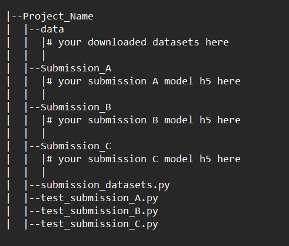

# Test case for Dicoding's TFD preparation Course

>DISCLAIMER!! this test case based on my experince on this course. I dont know how Dicoding grade your submission

## How to use

> make sure your project have the required environtment , described in [Setting_Up_TF_Developer_Certificate_Exam.pdf](https://www.tensorflow.org/extras/cert/Setting_Up_TF_Developer_Certificate_Exam.pdf)

* Download all the python scripts in this repository (`submission_datasets.py, test_submission_A.py, test_submission_B.py, test_submission`)
* Download the data.zip file from [this link](https://drive.google.com/file/d/1L3RV_Z845InhWYfffF-PXHbQtUcvangQ/view?usp=sharing) and extract it, this files contain the datasets that i already preprocessed.
* Move the scripts and data to your project directory, example directory structure:

* run the `test_submision_X.py` for each submission A, B and C respectively